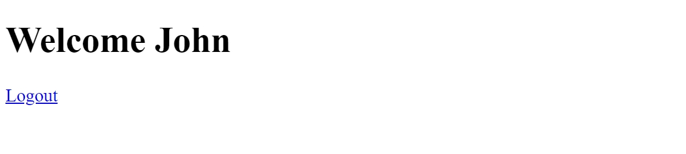

# Login Form Tutorial

## Overview

In this tutorial, we will be creating a login form using the following technologies:

- Node.js
- Express.js
- Express Session
- Passport.js
- EJS

Heres a preview of what we will be building:

<figure markdown>
  
  <figcaption>Homepage (Not Logged in)</figcaption>
</figure>

<figure markdown>
  
  <figcaption>Login Page</figcaption>
</figure>

<figure markdown>
  
  <figcaption>Homepage (Logged in)</figcaption>
</figure>
The aim of this tutorial is to help you learn how to integrate Passport.js to authenticate users in your own web applications.

## Prerequisites

- Basic knowledge of HTML and CSS - how to use them to build a simple web page.
- Basic knowledge of Node.js and Express.js - how to create [routes](https://expressjs.com/en/starter/basic-routing.html) and knowledge of how to create and use [Express middlewares](https://expressjs.com/en/guide/using-middleware.html).
- Basic knowledge of EJS - how to use it to render HTML templates.
- Abilty to use the terminal to run commands.

## Project Structure

The project structure will be as follows:

```bash
|-- login-form-tutorial              # Root Directory
    |-- public                       # Public Directory
            |-- style.css            # Style.css File
    |-- views                        # Views Directory
            |-- index.ejs            # Homepage Ejs File
            |-- login.ejs            # Login Page Ejs File
    | -- app.js                      # Express App File
    |-- package.json                 # Package.json File
    |-- node_modules                 # Node Modules Directory
```

## Conclusion

In this section we looked at the project structure and the technologies that we will be using in this tutorial.

In the next section, we will be setting up the project directory and installing the required libraries.
