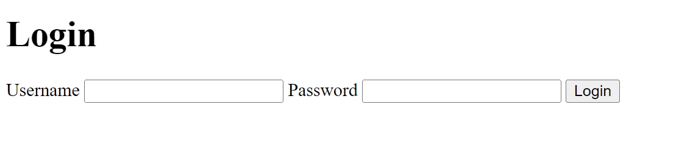

## Overview

This section will guide you through the process of setting up the login form page for our project.

Heres a preview of what we will be building:

<figure markdown>
  
  <figcaption>Login page</figcaption>
</figure>

## Setting up the login page

#### 1. Add the `/login` GET route to `app.js`

If have already made a login route in `app.js` from the previous section, you can skip this step.
Put the following code at the bottom of the `app.js` file, just before the `app.listen` function:

```javascript
...
app.get("/login", (req, res) => { //<--- Put login route here
	res.render("login");
});

app.listen(3000, () => {
	console.log("Login App listening on port 3000!");
});
```

This will add a `GET` route to the `/login` route in `app.js`. This will display the `login.ejs` file when the `/login` route is requested.

#### 2. Editing the `login.ejs` file

In the views folder, in the `login.ejs` file, we will create a simple login page that will be rendered when the `/login` route is requested. The form will send a `POST` request to the `/login` route.

```html
<!DOCTYPE html>
<html lang="en">
	<head>
		<meta charset="UTF-8" />
		<meta name="viewport" content="width=device-width, initial-scale=1.0" />
		<title>Login</title>
	</head>
	<body>
		<h1>Login</h1>
		<form action="/login" method="POST">
			<label for="username">Username</label>
			<input type="text" name="username" id="username" />
			<label for="password">Password</label>
			<input type="password" name="password" id="password" />
			<button type="submit">Login</button>
		</form>
	</body>
</html>
```

#### 3. Add the `/login` POST route to `app.js`

Put the following code at the bottom of the `app.js` file:

```javascript
app.post("/login", (req, res) => {
	const { username, password } = req.body;
	console.log({ username, password });
	res.redirect("/login");
});
```

This will add a `POST` route to the `/login` route in `app.js`.

For now we are just logging the username and password to the console to make sure that the form is working.

## Conclusion

In this section we looked at how to create a simple login page using EJS.

In the next section, we will be adding the login functionality to the login page.
